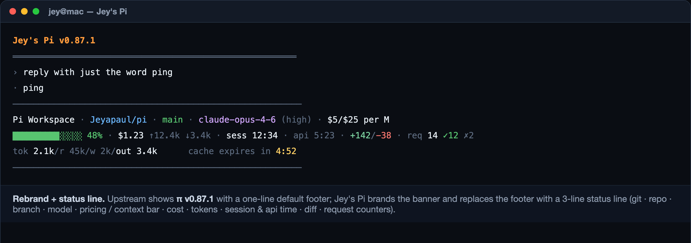
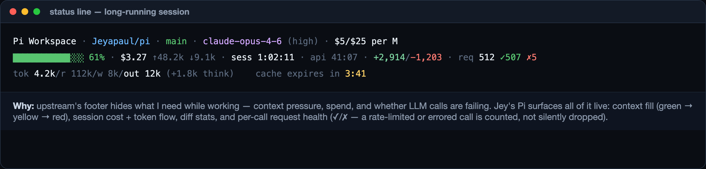
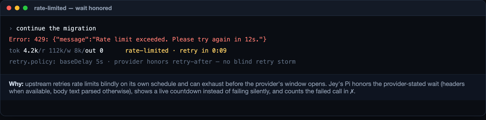
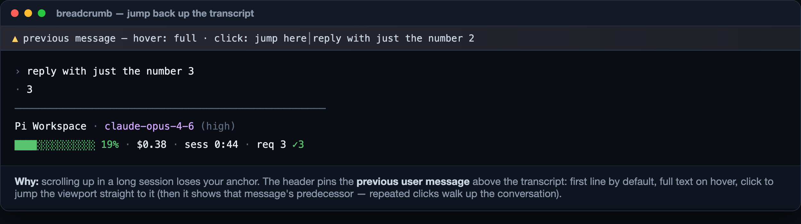
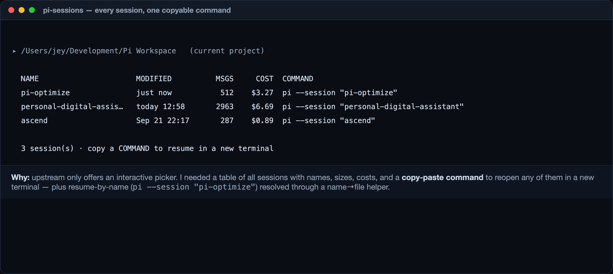

<p align="center"><h1>🏔 Jey's Pi</h1></p>
<p align="center">A personal fork of <a href="https://github.com/earendil-works/pi">earendil-works/pi</a> — <code>pi</code> with my customizations applied on top of every upstream release.</p>

## What's different from upstream pi?

| Change | Where | Why | How to use |
|--------|-------|-----|------------|
| **Rebrand to "Jey's Pi"** | `packages/coding-agent/src/modes/interactive/interactive-mode.ts:958,1069,1071` (marked `JEYS_PI`) | Personal identity in the startup banner and terminal title. Deliberately NOT via `piConfig.name` — that renames `APP_NAME` globally, which breaks `PI_*` env-var prefixes and upstream tests asserting `"pi --help"` strings | Nothing to do — the banner shows `Jey's Pi vX.Y.Z` on startup |
| **Package identity `@jeyapaul/pi`** | `packages/coding-agent/package.json` → `name` | Releases are packaged as `@jeyapaul/pi` tarballs on [GitHub Releases](../../releases) so my machines install my build, not upstream's | `npm i -g` from a release tarball — see [INSTALL.md](INSTALL.md) |
| **Automated upstream sync** | `.github/workflows/sync-upstream.yml` | Keeps `main` synced with upstream and re-applies my changes (branch `working`) on top automatically | Automatic weekly + manual dispatch; conflicts open a PR against `working` for me to resolve first |
| **Release pipeline** | `.github/workflows/release.yml` | Every merge of `working` → `main` is tested, built, packaged and published as a GitHub Release tagged like upstream (`v0.87.1`, …) so fork and parent versions stay in sync | Merge `working` → `main` (I do this manually on instruction); the release is created automatically |
| **Pinned model data** | `packages/ai/src/providers/data/` (committed) | CI builds offline from a pinned provider-catalog snapshot — upstream's live models.dev fetch makes tests flaky (provider renames break model-id type unions between runs). Re-pin with `npm run hydrate:model-data` when adopting upstream changes |
| **Personal config bundle** | [`jey/`](jey/) — extensions (`status-line.ts` 3-line footer, `message-header.ts` breadcrumb bar, `ketch-tools.ts` web research suite), `plan-mode` skill, `pi-sessions`/`resolve-session.js` helpers, settings template | My session tooling travels with the fork; a new machine gets the identical setup with one command. The ketch tools give the agent web search, page scraping, version-correct library docs (Context7), and OSS code search as first-class tools | Run [`jey/setup.sh`](jey/setup.sh) after installing (see [INSTALL.md](INSTALL.md)) — idempotent, never touches your model/package choices. Optional `CONTEXT7_API_KEY` env var enables `ketch_docs` |

## Screenshots — every customization, why it exists

### 🖥️ Rebrand + 3-line status line



Upstream shows `π vX.Y.Z` with a one-line default footer. I live in the terminal all day — I need **identity** (which fork is running), **git context** (repo · branch), **model + effort + pricing**, and a **3-line status footer**: context-fill bar (green → yellow → red), session cost with token flow, session/api time, diff stats, and per-call request health. This is the "at a glance" layer — I never run `/session` or `pi -p` to check spend mid-task.

### 📊 Request accounting + long-session detail



Zoom on a long-running session: `req 512 ✓507 ✗5` counts **every LLM call** — successes green, failures red (a rate-limited or errored call is counted, not silently dropped — upstream gives extensions no retry-attempt signal, so counting is done at message end-state). Context pressure at 61% with cost trends keeps "can I finish this task in-context?" answerable without opening dialogs.

### ⏳ Rate-limit waits, honored & visible



Upstream retries rate limits blindly on its own schedule and can exhaust before the provider's window opens, halting the workflow. Jey's Pi honors the **provider-stated wait** (headers when available; body text like *"try again in 12s"* parsed otherwise), shows a **live countdown** instead of failing silently, and the retry policy is tuned so the wait is respected, not retried into.

### 🧭 Message breadcrumb header



Scrolling up in a long session loses your anchor. The breadcrumb header pins the **previous user message** above the transcript: first line by default, full text on hover, click to jump the viewport straight to it — then it shows that message's predecessor, so repeated clicks walk up the conversation. (Fullscreen mode: `tuiMode: "fullscreen"` keeps the input dock fixed while the transcript scrolls.)

### 🗂️ Session table with copyable resume commands



Upstream only offers an interactive picker. I need to reopen any session **in a new terminal, on any machine**: `pi-sessions` prints all sessions (name, modified, msgs, cost) with a ready `pi --session "name"` command, and resume-by-name is resolved through a name→file helper — no IDs to copy.

<div align="center">

---

**Everything below this divider is upstream pi's README, unchanged.**

---

</div>


---

<p align="center">
  <a href="https://pi.dev">
    
  </a>
</p>
<p align="center">
  <a href="https://discord.com/invite/3cU7Bz4UPx"></a>
  <a href="https://www.npmjs.com/package/@earendil-works/pi-coding-agent"></a>
</p>

> New issues and PRs from new contributors are auto-closed by default. Maintainers review auto-closed issues daily. See [CONTRIBUTING.md](CONTRIBUTING.md).

# Pi

Pi is a minimal, extensible agent harness that you can make your own.

Adapt Pi to your workflows, not the other way around. Customize Pi with [extensions](packages/coding-agent/docs/extensions.md), [skills](packages/coding-agent/docs/skills.md), [prompt templates](packages/coding-agent/docs/prompt-templates.md), and [themes](packages/coding-agent/docs/themes.md). Bundle them as [Pi packages](packages/coding-agent/docs/packages.md) and share via npm or git.

Pi ships with powerful defaults but skips features like sub-agents and plan mode. Ask Pi to build what you want, or install a package that does it your way.

Use Pi [interactively](packages/coding-agent/docs/usage.md), automate it in [print or JSON mode](packages/coding-agent/docs/cli.md), control it over [RPC](packages/coding-agent/docs/rpc.md), or build apps with the [Pi TypeScript SDK](packages/coding-agent/docs/sdk.md). See [OpenClaw](https://github.com/OpenClaw/OpenClaw) for a real-world integration.

## Getting started

Install the command-line interface:

```bash
curl -fsSL https://pi.dev/install.sh | sh
```

On Windows:

```shell
powershell -c "irm https://pi.dev/install.ps1 | iex"
```

The installer pins all dependencies and updates Pi with `pi update`. Alternatively, install directly with npm, which does not pin transitive dependencies:

```bash
npm install -g --ignore-scripts @earendil-works/pi-coding-agent
```

Pi requires Node.js 22.19 or newer. The macOS, Linux, and Windows installers can install it if needed. Pi does not require dependency lifecycle scripts for a normal npm installation.

Start Pi in the directory where you want it to work:

```bash
cd /path/to/project
pi
```

For a built-in AI provider, run `/login` inside Pi to connect a subscription or API key. Then give Pi a task.

See the [documentation](https://pi.dev/docs/latest) for full setup and usage instructions, or [visit pi.dev](https://pi.dev) for demos.

## Run with Nix

```bash
nix run github:earendil-works/pi/stable
```

`stable` points at the latest release. Install it with `nix profile add github:earendil-works/pi/stable` and update with `nix profile upgrade pi`. Use a release tag such as `github:earendil-works/pi/v1.0.0` to pin a version, or `github:earendil-works/pi` for unreleased changes on `main`. Nix builds Pi from source.

Supports ARM64 and x86-64 on Linux and macOS. Use `nix build .` or `nix run .` to build or run your checkout.

Nix builds are offline, so the bundled model data comes from a pi.dev model catalog revision pinned in `nix/model-catalog.json`. At runtime, Pi still overlays newer catalog data from pi.dev as usual. The Nix workflow replaces the pin on `main` when it no longer matches the checkout, for example after a provider is added or gains a new model type. To refresh it by hand:

```bash
npm run update:model-catalog-pin
```

## Packages

This monorepo contains the Pi CLI and its supporting libraries.

| Package | Description |
|---------|-------------|
| **[@earendil-works/chord](packages/chord)** | Standalone application-composition runtime for services, replicated state, RPC, and plugins |
| **[@earendil-works/pi-telemetry](packages/telemetry)** | Vendor-neutral telemetry contracts, reference adapter, conformance tests, and typed schemas |
| **[@earendil-works/pi-ai](packages/ai)** | Unified multi-provider LLM API (OpenAI, Anthropic, Google, etc.) |
| **[@earendil-works/pi-durable](packages/durable)** | Durable conversation, task, and document runtime |
| **[@earendil-works/pi-agent-core](packages/agent)** | Agent runtime with tool calling and state management |
| **[@earendil-works/pi-coding-agent](packages/coding-agent)** | Interactive coding agent CLI |
| **[@earendil-works/pi-tui](packages/tui)** | Terminal UI library with differential rendering |

For Slack/chat automation and workflows see [earendil-works/pi-chat](https://github.com/earendil-works/pi-chat).

## Permissions & Containerization

Pi does not include a built-in permission system for restricting filesystem, process, network, or credential access. By default, it runs with the permissions of the user and process that launched it.

If you need stronger boundaries, containerize or sandbox Pi. See [packages/coding-agent/docs/containerization.md](packages/coding-agent/docs/containerization.md) for three patterns:

- **Gondolin extension**: keep `pi` and provider auth on the host while routing built-in tools and `!` commands into a local Linux micro-VM.
- **Plain Docker**: run the whole `pi` process in a local container for simple isolation.
- **OpenShell**: run the whole `pi` process in a policy-controlled sandbox.

## Contributing

See [CONTRIBUTING.md](CONTRIBUTING.md) for contribution guidelines and [AGENTS.md](AGENTS.md) for project-specific rules (for both humans and agents).  Longer term plans for Pi can also be found in [RFCs](https://rfc.earendil.com/keyword/pi/).

## Development

```bash
npm install --ignore-scripts  # Install all dependencies without running lifecycle scripts
npm run build         # Refresh model data, then build all packages
npm run build:offline # Rebuild using existing model data without network access
npm run check         # Lint, format, and type check
./test.sh            # Run tests (skips LLM-dependent tests without API keys)
./pi-test.sh         # Run pi from sources (can be run from any directory)
```

## Building standalone binaries from release source

GitHub releases include a versioned source archive covered by the release's `SHA256SUMS` file. Extract it and run the same build script used for the official standalone binaries:

```bash
VERSION="<release-version>"
tar -xzf "pi-${VERSION}-source.tar.gz"
cd "pi-${VERSION}"
./scripts/build-binaries.sh --offline-model-data --platform linux-x64 --out "$PWD/out"
```

The archive includes release model data and native prebuilds. `--offline-model-data` uses that model data without refreshing provider catalogs. The script installs dependencies and builds the executable with its runtime assets; pass `--skip-install` if dependencies are already provided.

## Supply-chain hardening

We treat npm dependency changes as reviewed code changes.

- Direct external dependencies are pinned to exact versions. Internal workspace packages remain version-ranged.
- `.npmrc` sets `save-exact=true` and `min-release-age=2` to avoid same-day dependency releases during npm resolution.
- `package-lock.json` is the dependency ground truth. Pre-commit blocks accidental lockfile commits unless `PI_ALLOW_LOCKFILE_CHANGE=1` is set.
- `npm run check` verifies pinned direct deps, native TypeScript import compatibility, and the generated coding-agent install lock.
- The pi.dev installer installs from `packages/coding-agent/install-lock/`, generated from the root lockfile, to pin transitive deps. The npm package does not pin transitive deps.
- Release smoke tests use `npm run release:local` to build, pack, and create isolated npm and Bun installs outside the repo before tagging a release.
- Local release installs, documented npm installs, and `pi update --self` use `--ignore-scripts` where supported.
- CI installs with `npm ci --ignore-scripts`, and a scheduled GitHub workflow runs `npm audit --omit=dev` plus `npm audit signatures --omit=dev`.
- Install lock generation has an explicit allowlist for dependency lifecycle scripts; new lifecycle-script deps fail checks until reviewed.

## Share your OSS coding agent sessions

If you use Pi or other coding agents for open source work, please share your sessions.

Public OSS session data helps improve coding agents with real-world tasks, tool use, failures, and fixes instead of toy benchmarks.

For the full explanation, see [this post on X](https://x.com/badlogicgames/status/2037811643774652911).

To publish sessions, use [`badlogic/pi-share-hf`](https://github.com/badlogic/pi-share-hf). Read its README.md for setup instructions. All you need is a Hugging Face account, the Hugging Face CLI, and `pi-share-hf`.

You can also watch [this video](https://x.com/badlogicgames/status/2041151967695634619), where I show how I publish my `pi-mono` sessions.

I regularly publish my own `pi-mono` work sessions here:

- [badlogicgames/pi-mono on Hugging Face](https://huggingface.co/datasets/badlogicgames/pi-mono)

## License

MIT

<p align="center">
  <a href="https://pi.dev">pi.dev</a> domain graciously donated by
  <br /><br />
  <a href="https://exe.dev"><br />exe.dev</a>
</p>
